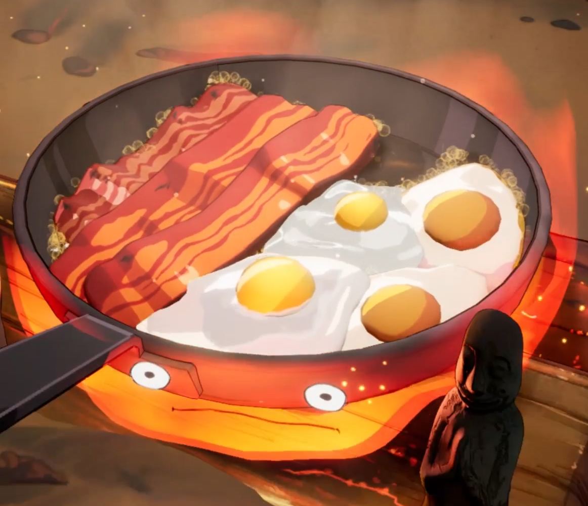
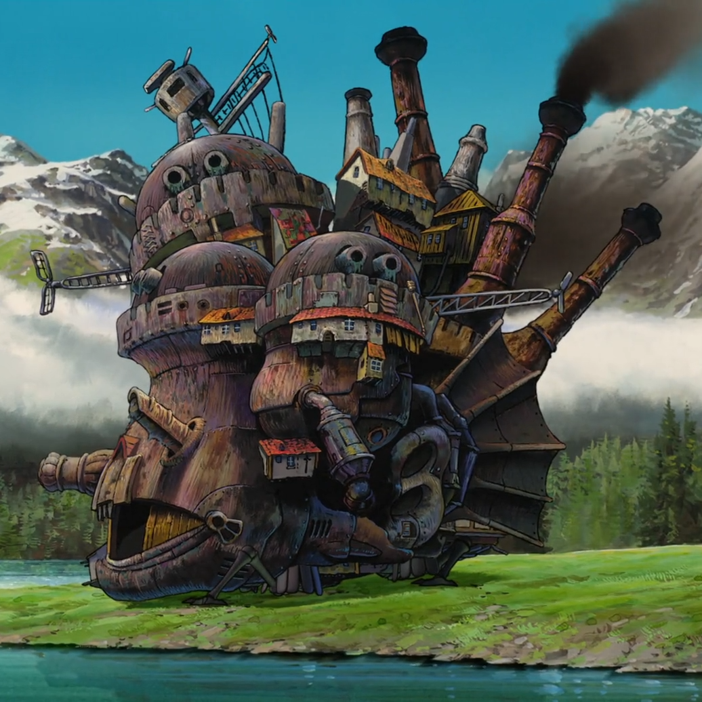

# CS479-3DML-Project

## Steps to reproduce

## Installation

Install threestudio & animate124:

```
https://github.com/threestudio-project/threestudio.git

cd custom
git clone -b threestudio https://github.com/HeliosZhao/Animate124.git
mv Animate124 threestudio-animate124

cd ..
```

(Cuda v12.4, same as KCloud) Install bitsandbtyes:

```
git clone https://github.com/TimDettmers/bitsandbytes.git
cd bitsandbytes

export CUDA_VERSION=124
export CUDA_HOME=/usr/local/cuda
export LD_LIBRARY_PATH=$CUDA_HOME/lib64:$LD_LIBRARY_PATH

python setup.py install

cd ..
```

(Optional, Recommended) Create a virtual environment:

```
conda create -n threestudio python=3.10 -y
conda activate threestudio
```

(Cuda v12.4, same as KCloud) Install dependencies:

```
pip install -r requirements.txt
```

## Processed Image List

Refer to [README.md](threestudio/custom/threestudio-animate124/README.md), but modify it according to the instructions below.

### calcifer



- Input image: `threestudio/custom/threestudio-animate124/load/calcifer/image.jpg`
- Textual inversion (VRAM 5GB, 40min)
- Stage 1 (VRAM 24GB, 85min)
- Stage 2 (VRAM 43GB, 300min)
- Stage 3 (VRAM 46GB, 160min)

| Key               | Value                                                                                          |
| ----------------- | ---------------------------------------------------------------------------------------------- |
| Folder Name       | `calcifer`                                                                                     |
| Placeholder Token | `_calcifer_`                                                                                   |
| Init Token        | `flame`                                                                                        |
| Validation Prompt | A high-resolution DSLR image of ${placeholder_token}                                           |
| STATIC_PROMPT     | a cartoon-style DSLR image of calcifer under a frying pan, glowing warmly, Studio Ghibli style |
| DYNAMIC_PROMPT    | calcifer is dancing with fire sparks under a frying pan in anime style                         |
| CN_PROMPT         | a <token> is dancing like a flame spirit from Ghibli                                           |

### howl-castle



- Input image: `threestudio/custom/threestudio-animate124/load/howl-castle/image.jpg`
- Textual inversion (VRAM 15GB, 95min)
- Stage 1 (VRAM 33GB, 75min)
- Stage 2 (VRAM 48GB, 310min)
- Stage 3 (VRAM 43GB, 163min)

| Key               | Value                                                                                 |
| ----------------- | ------------------------------------------------------------------------------------- |
| Folder Name       | `howl-castle`                                                                         |
| Placeholder Token | `_howlcastle_`                                                                        |
| Init Token        | `castle`                                                                              |
| Validation Prompt | anime-style walking steampunk castle with chimneys and houses, lush valley background |
| STATIC_PROMPT     | an anime-style image of `_howlcastle_` steampunk castle standing in a lush valley     |
| DYNAMIC_PROMPT    | an anime-style `_howlcastle_` walking across a meadow, smoke rising from its chimneys |
| CN_PROMPT         | an anime-style `<token>` walking through grasslands with mechanical legs and smoke    |

### howl-hin

- Input image: `threestudio\custom\threestudio-animate124\load\howl-hin\image.jpg`
- Textual inversion (VRAM 5GB, 40min)
- Stage 1 (VRAM 24GB, 85min)
- Stage 2 (VRAM 43GB, 300min)
- Stage 3 (VRAM 46GB, 160min)

### howl-markl

- Input image: `threestudio\custom\threestudio-animate124\load\howl-markl\image.jpg`
- Textual inversion (VRAM 5GB, 40min)
- Stage 1 (VRAM 24GB, 85min)
- Stage 2 (VRAM 43GB, 300min)
- Stage 3 (VRAM 46GB, 160min)

### howl-sophie-flying

- Input image: `threestudio\custom\threestudio-animate124\load\howl-sophie-flying\image.jpg`
- Textual inversion (VRAM 5GB, 40min)
- Stage 1 (VRAM 24GB, 85min)
- Stage 2 (VRAM 43GB, 300min)
- Stage 3 (VRAM 46GB, 160min)

### magic-scarecrow

- Input image: `threestudio\custom\threestudio-animate124\load\magic-scarecrow\image.jpg`
- Textual inversion (VRAM 5GB, 40min)
- Stage 1 (VRAM 24GB, 85min)
- Stage 2 (VRAM 43GB, 300min)
- Stage 3 (VRAM 46GB, 160min)

### spring-thief

- Input image: `threestudio\custom\threestudio-animate124\load\spring-thief\image.jpg`
- Textual inversion (VRAM 5GB, 40min)
- Stage 1 (VRAM 24GB, 85min)
- Stage 2 (VRAM 43GB, 300min)
- Stage 3 (VRAM 46GB, 160min)

## 3D Scene Reconstruction
After reconstructing, execute (We already have precomputed file. Change the directory in this shell script if you want to replace it to your owns)
```
bash process_video.sh
```
Then
```
bash process_data.sh
```
Then
```
bash train_splatfacto.sh
```
Then
```
bash render_scene.sh
```

